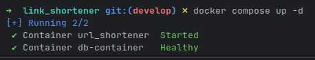
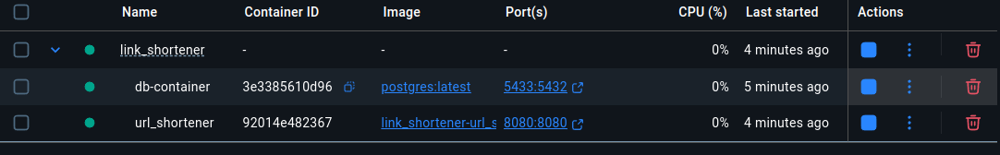
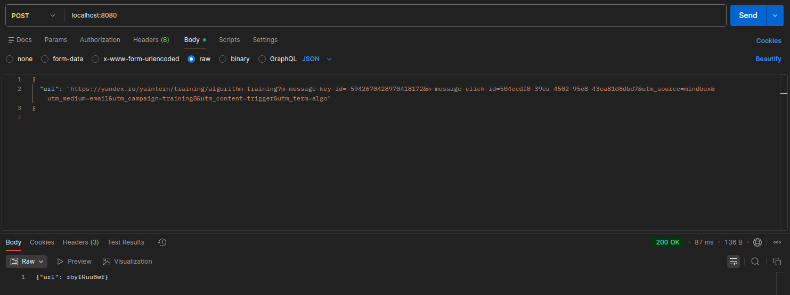
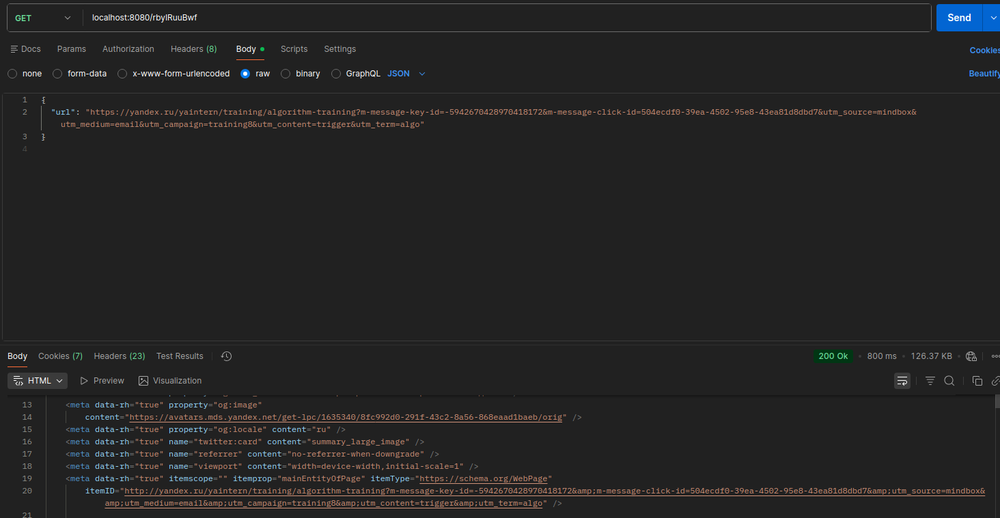
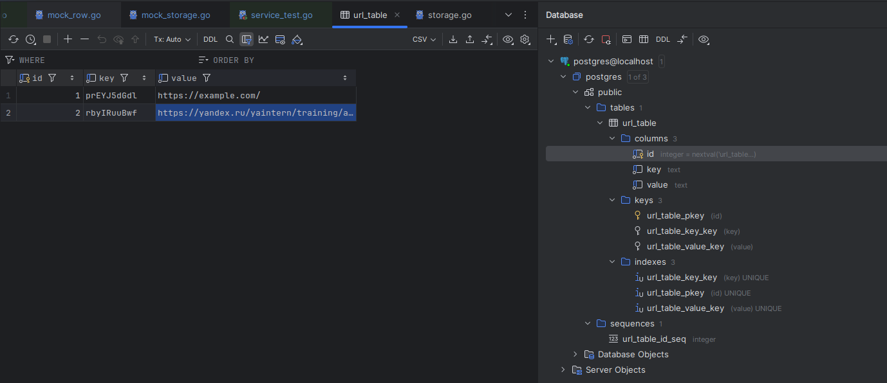

# link_shortenet
1. Клонируем репозиторий

2. Переходим в папку с проектом

3. Командой docker compose up -d запускаем контейнеры

4. Проверяем состояние контейнеров

5. Открываем Postman для того , что бы протестировать метод POST

6. Проверка метода Get

