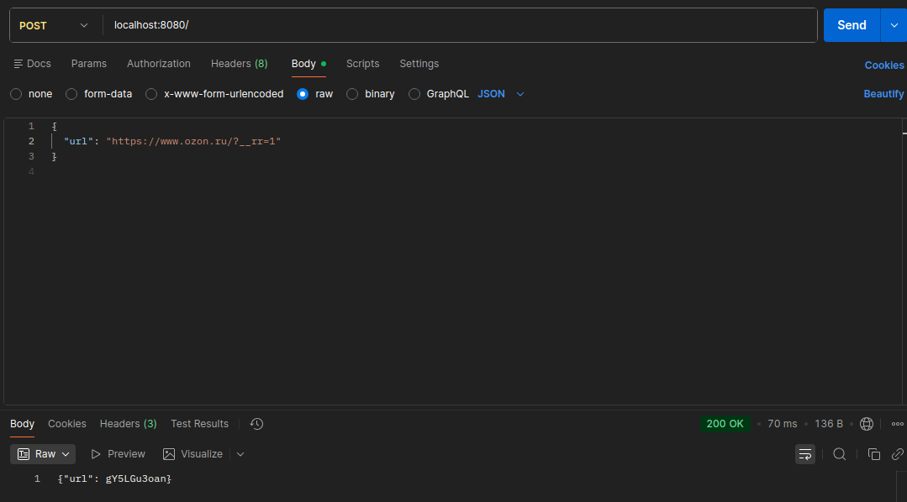
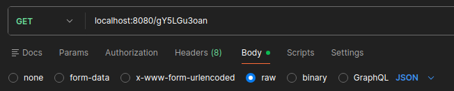

# link_shortener
1. Клонируем репозиторий
2. Переходим в папку с проектом
3. Командой docker compose up -d запускаем контейнеры
4. Проверяем состояние контейнеров
5. Открываем Postman для того , что бы протестировать метод POST

